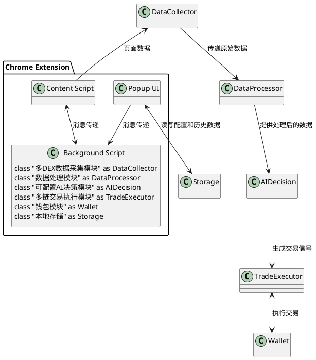
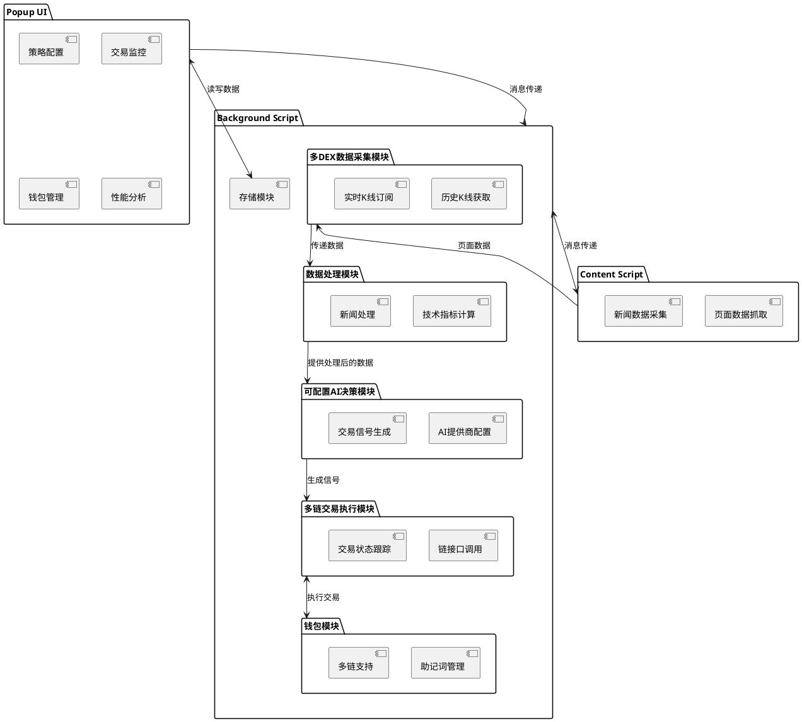

# Algonius 技术方案

## 1. 需求描述

### 产品名称
Algonius

### 产品描述
Algonius是一个基于DEX的量化交易Chrome浏览器插件,旨在为加密货币交易者提供智能化、自动化的交易解决方案。该插件能够从多个DEX获取实时K线数据,同时从X(原Twitter)页面抓取相关代币新闻。插件将结合这些数据,利用可配置的AI技术根据用户定义的策略生成交易信号,并通过内置钱包功能自动执行多链交易操作。

### 主要功能
1. 多DEX支持：能够对接多个DEX平台,获取实时K线数据。
2. 实时K线数据采集：支持获取历史K线和订阅新K线。
3. 新闻数据抓取：从X.com抓取相关代币新闻。
4. 技术指标计算：基于K线数据计算常用技术指标。
5. 可配置AI决策：支持多种AI提供商(如OpenAI、Claude AI、Google AI、Ollama等),结合技术指标、新闻数据和用户策略生成交易信号。
6. 内置钱包功能：支持生成或导入助记词,实现自动交易。
7. 多链交易执行：支持在多个区块链上自动执行买入或卖出操作。
8. 用户界面：提供策略配置、交易监控、钱包管理和性能分析等功能。

## 2. 概要设计

### 2.1 架构图

### 2.2 模块图

### 2.3 关键技术难点分析

1. **多DEX数据采集的一致性和实时性**
   - 难点：不同DEX的数据结构和更新频率可能不同。
   - 解决方案：设计统一的数据模型,使用适配器模式处理不同DEX的数据格式,采用WebSocket实现实时数据更新。

2. **浏览器插件中的高性能计算**
   - 难点：在插件环境中进行大量技术指标计算可能影响性能。
   - 解决方案：利用Web Workers进行并行计算,采用增量计算策略,必要时使用WebAssembly优化计算密集型任务。

3. **安全的钱包管理**
   - 难点：在浏览器环境中安全地存储和使用私钥。
   - 解决方案：使用浏览器的安全存储API,采用加密算法保护私钥,实现硬件钱包集成支持。

4. **多链交易的一致性**
   - 难点：不同区块链的交易机制和接口可能存在差异。
   - 解决方案：设计抽象的交易接口,为每条支持的链实现具体的适配器。

5. **AI决策的实时性和准确性**
   - 难点：在有限的计算资源和时间内生成准确的交易信号。
   - 解决方案：优化AI模型,实现本地轻量级模型与云端高级模型的混合使用,采用缓存机制提高响应速度。

## 3. 详细设计

### 3.1 Popup UI模块 (实现在popup.html和popup.js)

接口:
   1. **initUI()**
      - 功能：初始化插件UI
      - 输入：无
      - 输出：无
      - 业务逻辑：创建popup窗口,渲染主界面,初始化各功能区域

   2. **updateDashboard(data)**
      - 功能：更新交易面板数据
      - 输入：data (Object) - 包含K线、指标、新闻摘要等信息
      - 输出：无
      - 业务逻辑：根据输入数据更新UI上的各项指标和图表

   3. **showTradeConfirmation(tradeInfo)**
      - 功能：显示交易确认对话框
      - 输入：tradeInfo (Object) - 包含交易对、数量、价格等信息
      - 输出：Promise[boolean] - 用户确认结果
      - 业务逻辑：弹出确认对话框,等待用户确认或取消

   4. **manageWallet(action, params)**
      - 功能：管理钱包操作
      - 输入：action (String) - 操作类型, params (Object) - 操作参数
      - 输出：Promise[Object] - 操作结果
      - 业务逻辑：根据action执行相应的钱包操作,如生成助记词、导入助记词、查看地址等

### 3.2 多DEX数据采集模块 (实现在background.js)

接口:
1. **getHistoricalKlines(token, timeframe, limit)**
   - 功能：获取某个Token的历史K线数据
   - 输入：token (String) - Token标识, timeframe (String) - 时间框架, limit (Number) - 获取数量
   - 输出：Promise<Array> - 历史K线数据数组
   - 业务逻辑：根据指定的DEX和参数获取历史K线数据

2. **subscribeToKlines(token, timeframe, callback)**
   - 功能：订阅某个Token的实时K线数据
   - 输入：token (String) - Token标识, timeframe (String) - 时间框架, callback (Function) - 数据回调函数
   - 输出：Subscription - 订阅对象
   - 业务逻辑：建立WebSocket连接,实时接收并处理新的K线数据

3. **collectNewsData()**
   - 功能：从X.com页面采集新闻数据
   - 输入：无
   - 输出：Promise<Array> - 新闻数据数组
   - 业务逻辑：通过消息传递机制从Content Script获取新闻数据,进行初步处理后返回

### 3.3 数据处理模块 (实现在background.js)

接口:
1. **calculateIndicators(klineData)**
   - 功能：计算技术指标
   - 输入：klineData (Array) - K线数据
   - 输出：Object - 包含各项技术指标的对象
   - 业务逻辑：根据输入的K线数据,计算MA、RSI、MACD等指标

2. **processNewsData(newsData)**
   - 功能：处理新闻数据
   - 输入：newsData (Array) - 原始新闻数据
   - 输出：Array - 处理后的新闻摘要数组
   - 业务逻辑：对新闻进行情感分析,提取关键词,生成摘要

### 3.4 可配置AI决策模块 (实现在background.js)

接口:
1. **configureAIProvider(providerConfig)**
   - 功能：配置AI提供商
   - 输入：providerConfig (Object) - 包含提供商类型、API密钥等配置信息
   - 输出：Promise[boolean] - 配置是否成功
   - 业务逻辑：根据提供的配置信息设置AI提供商

2. **generateTradeSignal(marketData, userStrategy)**
   - 功能：生成交易信号
   - 输入：
     marketData (Object) - 包含K线、指标、新闻等市场数据
     userStrategy (String) - 用户定义的策略
   - 输出：Promise[Object] - 包含交易信号和理由的对象
   - 业务逻辑：调用配置的AI提供商API,将市场数据和用户策略作为输入,生成交易信号

### 3.5 多链交易执行模块 (实现在background.js)

接口:
1. **executeTrade(tradeSignal, chainId)**
   - 功能：在指定链上执行交易操作
   - 输入：tradeSignal (Object) - 包含交易类型、数量等信息, chainId (String) - 目标链标识
   - 输出：Promise[Object] - 交易结果
   - 业务逻辑：根据交易信号和指定的链,调用相应的链接口执行买入或卖出操作

2. **getTransactionStatus(txHash, chainId)**
   - 功能：获取交易状态
   - 输入：txHash (String) - 交易哈希, chainId (String) - 链标识
   - 输出：Promise[Object] - 交易状态信息
   - 业务逻辑：查询指定链上的交易状态并返回结果

### 3.6 钱包模块 (实现在background.js)

接口:
1. **generateMnemonic()**
   - 功能：生成新的助记词
   - 输入：无
   - 输出：Promise[String] - 生成的助记词
   - 业务逻辑：使用密码学安全的方法生成新的助记词

2. **importMnemonic(mnemonic)**
   - 功能：导入已有助记词
   - 输入：mnemonic (String) - 助记词
   - 输出：Promise[boolean] - 导入是否成功
   - 业务逻辑：验证并导入提供的助记词

3. **getAddresses(chainId)**
   - 功能：获取指定链的钱包地址
   - 输入：chainId (String) - 链标识
   - 输出：Promise[String] - 钱包地址
   - 业务逻辑：根据chainId派生对应的钱包地址并返回

### 3.7 存储模块 (实现在background.js)

接口:
1. **saveData(key, value)**
   - 功能：保存数据到本地存储
   - 输入：key (String), value (Any)
   - 输出：Promise<void>
   - 业务逻辑：将数据序列化并保存到Chrome的存储API中

2. **getData(key)**
   - 功能：从本地存储获取数据
   - 输入：key (String)
   - 输出：Promise<Any>
   - 业务逻辑：从Chrome的存储API中检索并反序列化数据

### 3.8 Content Script (实现在content.js)

接口:
1. **scrapePageData()**
   - 功能：从当前页面抓取相关数据
   - 输入：无
   - 输出：Promise[Object] - 包含K线或新闻数据的对象
   - 业务逻辑：根据当前页面类型(DEX或X.com),抓取相应的K线或新闻数据

2. **injectCustomScript()**
   - 功能：向页面注入自定义脚本
   - 输入：无
   - 输出：无
   - 业务逻辑：在需要时向页面注入脚本以增强数据抓取能力或实现特定功能

## 4. 数据流

1. Content Script (content.js) 从DEX和X.com页面抓取原始数据。
2. 数据通过消息传递机制发送到Background Script (background.js)。
3. Background Script 中的数据处理模块处理原始数据，计算技术指标。
4. 处理后的数据传递给AI决策模块，生成交易信号。
5. 交易信号传递给交易执行模块，根据用户设置决定是否自动执行。
6. 交易结果和更新后的数据通过消息传递机制发送到Popup UI (popup.js)进行展示。

## 5. 安全考虑

1. **数据加密**：所有敏感数据（如API密钥、助记词）在存储和传输过程中都应使用强加密算法。
2. **安全通信**：使用HTTPS协议进行所有外部API调用。
3. **输入验证**：对所有用户输入进行严格的验证和清洗，防止XSS和注入攻击。
4. **最小权限原则**：在manifest.json中只申请必要的权限，减少潜在的安全风险。
5. **代码完整性**：实现CSP (Content Security Policy) 以防止恶意代码注入。
6. **定期安全审计**：对插件代码进行定期的安全审计和漏洞扫描。

## 6. 性能优化

1. **使用Web Workers**：将耗时的计算任务（如技术指标计算）放在Web Worker中执行，避免阻塞主线程。
2. **数据缓存**：实现智能缓存机制，减少重复的数据请求和计算。
3. **懒加载**：对于非关键数据和功能，采用懒加载策略。
4. **资源压缩**：对插件的JavaScript、CSS和HTML文件进行压缩，减少加载时间。
5. **异步操作**：尽可能使用异步操作，提高插件的响应速度。
6. **内存管理**：及时释放不再使用的大型对象，避免内存泄漏。

## 7. 扩展性考虑

1. **模块化设计**：采用高度模块化的设计，便于未来添加新功能或支持新的DEX平台。
2. **插件化架构**：考虑实现插件化架构，允许第三方开发者为Algonius开发扩展功能。
3. **API抽象**：为核心功能提供抽象的API接口，便于未来的功能扩展和第三方集成。
4. **配置驱动**：尽可能使用配置文件驱动功能，减少硬编码，提高灵活性。

## 8. 参考资料

1. [Chrome Extension开发文档](https://developer.chrome.com/docs/extensions/)
2. [Web Workers API](https://developer.mozilla.org/en-US/docs/Web/API/Web_Workers_API)
3. [Chrome存储API](https://developer.chrome.com/docs/extensions/reference/storage/)
4. [OpenAI API文档](https://platform.openai.com/docs/api-reference)
5. [Web3.js文档](https://web3js.readthedocs.io/)
6. [TradingView轻量级图表库](https://www.tradingview.com/lightweight-charts/)
7. [CryptoCompare API](https://min-api.cryptocompare.com/)
8. [区块链安全最佳实践](https://consensys.github.io/smart-contract-best-practices/)
9. [OWASP浏览器扩展安全检查表](https://owasp.org/www-project-web-security-testing-guide/latest/4-Web_Application_Security_Testing/11-Client-side_Testing/05-Testing_Browser_Extensions)